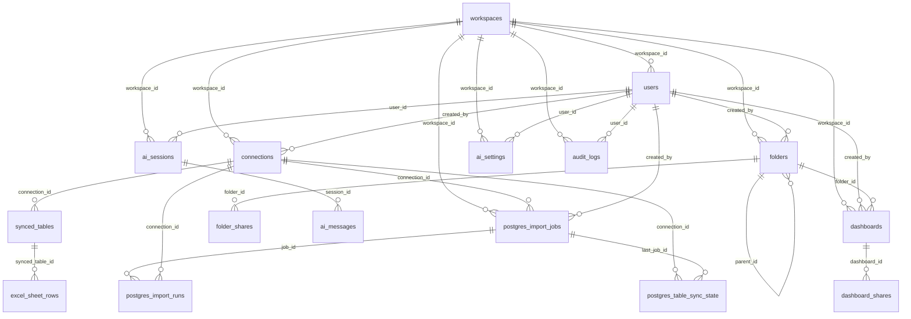

# 360Data Database Reference

## 1) Scope
Tài liệu này mô tả database hiện có dựa trên các migration SQL:
- `server/migrations/001_schema.sql`
- `server/migrations/002_excel_import.sql`
- `server/migrations/003_google_sheets_import.sql`
- `server/migrations/004_postgres_ingestion.sql`

Target: PostgreSQL 14+  
Extension: `uuid-ossp`

## 2) ER Diagram

## 3) Global Conventions
- PK hầu hết là `UUID` với default `uuid_generate_v4()`.
- Timestamp dùng `TIMESTAMPTZ` và default `NOW()`.
- Nhiều bảng dùng `JSONB` cho cấu hình/state.
- Soft delete dùng `is_deleted BOOLEAN DEFAULT FALSE` ở một số bảng nghiệp vụ.

## 4) Data Dictionary

### 4.1 `workspaces`
Mô tả: Tenant/workspace của hệ thống.

| Column | Type | Null | Default | Constraint/Notes |
|---|---|---|---|---|
| id | UUID | NO | uuid_generate_v4() | PK |
| domain | VARCHAR(255) | NO | - | UNIQUE |
| name | VARCHAR(255) | YES | - | - |
| created_at | TIMESTAMPTZ | NO | NOW() | - |
| updated_at | TIMESTAMPTZ | NO | NOW() | trigger cập nhật khi UPDATE |

Indexes:
- `idx_workspaces_domain(domain)`

### 4.2 `users`
Mô tả: Người dùng trong workspace.

| Column | Type | Null | Default | Constraint/Notes |
|---|---|---|---|---|
| id | UUID | NO | uuid_generate_v4() | PK |
| workspace_id | UUID | YES | - | FK -> `workspaces(id)` ON DELETE CASCADE |
| email | VARCHAR(255) | NO | - | UNIQUE |
| password_hash | VARCHAR(255) | NO | - | - |
| name | VARCHAR(255) | NO | - | - |
| role | VARCHAR(20) | NO | 'Viewer' | CHECK IN ('Admin','Editor','Viewer') |
| status | VARCHAR(20) | NO | 'Pending' | CHECK IN ('Active','Pending','Disabled') |
| job_title | VARCHAR(255) | YES | - | - |
| phone_number | VARCHAR(50) | YES | - | - |
| company_size | VARCHAR(50) | YES | - | - |
| level | VARCHAR(50) | YES | - | - |
| department | VARCHAR(100) | YES | - | - |
| industry | VARCHAR(100) | YES | - | - |
| joined_at | TIMESTAMPTZ | NO | NOW() | - |
| updated_at | TIMESTAMPTZ | NO | NOW() | trigger cập nhật khi UPDATE |

Indexes:
- `idx_users_email(email)`
- `idx_users_workspace(workspace_id)`
- `idx_users_status(status)`

### 4.3 `connections`
Mô tả: Kết nối đến nguồn dữ liệu.

| Column | Type | Null | Default | Constraint/Notes |
|---|---|---|---|---|
| id | UUID | NO | uuid_generate_v4() | PK |
| workspace_id | UUID | NO | - | FK -> `workspaces(id)` ON DELETE CASCADE |
| created_by | UUID | NO | - | FK -> `users(id)` ON DELETE CASCADE |
| name | VARCHAR(255) | NO | - | - |
| type | VARCHAR(50) | NO | - | CHECK IN ('BigQuery','Snowflake','Redshift','PostgreSQL','Excel','GoogleSheets') |
| auth_type | VARCHAR(50) | NO | 'GoogleMail' | CHECK IN ('GoogleMail','ServiceAccount','Password') |
| email | VARCHAR(255) | YES | - | - |
| status | VARCHAR(20) | NO | 'Connected' | CHECK IN ('Connected','Error','Syncing') |
| project_id | VARCHAR(255) | YES | - | - |
| service_account_key | TEXT | YES | - | - |
| table_count | INTEGER | NO | 0 | - |
| config | JSONB | YES | '{}' | - |
| is_deleted | BOOLEAN | YES | FALSE | soft delete |
| created_at | TIMESTAMPTZ | NO | NOW() | - |
| updated_at | TIMESTAMPTZ | NO | NOW() | trigger cập nhật khi UPDATE |

Indexes:
- `idx_connections_workspace(workspace_id)`
- `idx_connections_created_by(created_by)`

### 4.4 `synced_tables`
Mô tả: Danh sách table/sheet đã sync trong từng connection.

| Column | Type | Null | Default | Constraint/Notes |
|---|---|---|---|---|
| id | UUID | NO | uuid_generate_v4() | PK |
| connection_id | UUID | NO | - | FK -> `connections(id)` ON DELETE CASCADE |
| table_name | VARCHAR(255) | NO | - | - |
| dataset_name | VARCHAR(255) | YES | - | - |
| row_count | INTEGER | NO | 0 | - |
| status | VARCHAR(20) | NO | 'Active' | CHECK IN ('Active','Disabled') |
| last_sync | TIMESTAMPTZ | YES | NOW() | - |
| schema_def | JSONB | YES | '[]' | - |
| is_deleted | BOOLEAN | YES | FALSE | soft delete |
| created_at | TIMESTAMPTZ | NO | NOW() | - |
| updated_at | TIMESTAMPTZ | NO | NOW() | không có trigger auto trong 001 |
| column_count | INTEGER | NO | 0 | thêm ở 002 |
| source_file_name | VARCHAR(255) | YES | - | thêm ở 002 (Excel) |
| upload_time | TIMESTAMPTZ | YES | - | thêm ở 002 (Excel) |
| source_sheet_name | VARCHAR(255) | YES | - | thêm ở 002 (Excel) |
| source_file_id | VARCHAR(255) | YES | - | thêm ở 003 (Google Sheets) |
| source_sheet_id | VARCHAR(255) | YES | - | thêm ở 003 (Google Sheets) |

Indexes/Constraints:
- `idx_synced_tables_connection(connection_id)`
- `idx_synced_tables_unique(connection_id, dataset_name, table_name)` UNIQUE
- `idx_synced_tables_conn_source_file(connection_id, source_file_id)`
- `idx_synced_tables_conn_file_sheet_unique_active(connection_id, source_file_id, source_sheet_id)` UNIQUE PARTIAL WHERE `source_file_id IS NOT NULL AND source_sheet_id IS NOT NULL AND is_deleted = FALSE`

### 4.5 `excel_sheet_rows`
Mô tả: Dữ liệu dòng từ Excel theo `synced_table_id`.

| Column | Type | Null | Default | Constraint/Notes |
|---|---|---|---|---|
| id | UUID | NO | uuid_generate_v4() | PK |
| synced_table_id | UUID | NO | - | FK -> `synced_tables(id)` ON DELETE CASCADE |
| row_index | INTEGER | NO | - | - |
| row_data | JSONB | NO | '{}' | nội dung 1 dòng |
| created_at | TIMESTAMPTZ | NO | NOW() | - |

Indexes/Constraints:
- UNIQUE (`synced_table_id`, `row_index`)
- `idx_excel_sheet_rows_table(synced_table_id)`
- `idx_excel_sheet_rows_table_row(synced_table_id, row_index)`

### 4.6 `folders`
Mô tả: Cây thư mục dashboard.

| Column | Type | Null | Default | Constraint/Notes |
|---|---|---|---|---|
| id | UUID | NO | uuid_generate_v4() | PK |
| workspace_id | UUID | NO | - | FK -> `workspaces(id)` ON DELETE CASCADE |
| created_by | UUID | NO | - | FK -> `users(id)` ON DELETE CASCADE |
| name | VARCHAR(255) | NO | - | - |
| parent_id | UUID | YES | - | self FK -> `folders(id)` ON DELETE CASCADE |
| icon | VARCHAR(50) | YES | - | - |
| color | VARCHAR(20) | YES | - | - |
| is_deleted | BOOLEAN | YES | FALSE | soft delete |
| created_at | TIMESTAMPTZ | NO | NOW() | - |
| updated_at | TIMESTAMPTZ | NO | NOW() | trigger cập nhật khi UPDATE |

Indexes:
- `idx_folders_workspace(workspace_id)`
- `idx_folders_parent(parent_id)`

### 4.7 `dashboards`
Mô tả: Metadata và state dashboard.

| Column | Type | Null | Default | Constraint/Notes |
|---|---|---|---|---|
| id | UUID | NO | uuid_generate_v4() | PK |
| workspace_id | UUID | NO | - | FK -> `workspaces(id)` ON DELETE CASCADE |
| created_by | UUID | NO | - | FK -> `users(id)` ON DELETE CASCADE |
| folder_id | UUID | YES | - | FK -> `folders(id)` ON DELETE SET NULL |
| title | VARCHAR(500) | NO | - | - |
| description | TEXT | YES | - | - |
| data_source_id | VARCHAR(255) | YES | - | - |
| data_source_name | VARCHAR(255) | YES | - | - |
| enable_cross_filter | BOOLEAN | YES | FALSE | - |
| pages | JSONB | YES | '[]' | - |
| widgets | JSONB | YES | '[]' | - |
| active_page_id | VARCHAR(255) | YES | - | - |
| global_filters | JSONB | YES | '[]' | - |
| calculated_fields | JSONB | YES | '[]' | - |
| quick_measures | JSONB | YES | '[]' | - |
| layout | JSONB | YES | '{}' | - |
| theme | JSONB | YES | '{}' | - |
| is_deleted | BOOLEAN | YES | FALSE | soft delete |
| created_at | TIMESTAMPTZ | NO | NOW() | - |
| updated_at | TIMESTAMPTZ | NO | NOW() | trigger cập nhật khi UPDATE |

Indexes:
- `idx_dashboards_workspace(workspace_id)`
- `idx_dashboards_folder(folder_id)`
- `idx_dashboards_created_by(created_by)`

### 4.8 `dashboard_shares`
Mô tả: Share dashboard theo email/user key.

| Column | Type | Null | Default | Constraint/Notes |
|---|---|---|---|---|
| id | UUID | NO | uuid_generate_v4() | PK |
| dashboard_id | UUID | NO | - | FK -> `dashboards(id)` ON DELETE CASCADE |
| user_id | VARCHAR(255) | NO | - | lưu email/string, không FK tới `users` |
| permission | VARCHAR(20) | NO | 'view' | CHECK IN ('view','edit','admin') |
| shared_at | TIMESTAMPTZ | NO | NOW() | - |

Indexes/Constraints:
- UNIQUE (`dashboard_id`, `user_id`)
- `idx_dashboard_shares_dashboard(dashboard_id)`
- `idx_dashboard_shares_user(user_id)`

### 4.9 `folder_shares`
Mô tả: Share folder theo email/user key.

| Column | Type | Null | Default | Constraint/Notes |
|---|---|---|---|---|
| id | UUID | NO | uuid_generate_v4() | PK |
| folder_id | UUID | NO | - | FK -> `folders(id)` ON DELETE CASCADE |
| user_id | VARCHAR(255) | NO | - | lưu email/string, không FK tới `users` |
| permission | VARCHAR(20) | NO | 'view' | CHECK IN ('view','edit','admin') |
| shared_at | TIMESTAMPTZ | NO | NOW() | - |

Indexes/Constraints:
- UNIQUE (`folder_id`, `user_id`)
- `idx_folder_shares_folder(folder_id)`
- `idx_folder_shares_user(user_id)`

### 4.10 `ai_sessions`
Mô tả: Phiên hội thoại AI.

| Column | Type | Null | Default | Constraint/Notes |
|---|---|---|---|---|
| id | UUID | NO | uuid_generate_v4() | PK |
| workspace_id | UUID | NO | - | FK -> `workspaces(id)` ON DELETE CASCADE |
| user_id | UUID | NO | - | FK -> `users(id)` ON DELETE CASCADE |
| title | VARCHAR(500) | NO | 'Data Exploration Hub' | - |
| created_at | TIMESTAMPTZ | NO | NOW() | - |
| updated_at | TIMESTAMPTZ | NO | NOW() | trigger cập nhật khi UPDATE |

Indexes:
- `idx_ai_sessions_user(user_id)`
- `idx_ai_sessions_workspace(workspace_id)`

### 4.11 `ai_messages`
Mô tả: Tin nhắn trong từng AI session.

| Column | Type | Null | Default | Constraint/Notes |
|---|---|---|---|---|
| id | UUID | NO | uuid_generate_v4() | PK |
| session_id | UUID | NO | - | FK -> `ai_sessions(id)` ON DELETE CASCADE |
| role | VARCHAR(20) | NO | - | CHECK IN ('user','assistant') |
| content | TEXT | NO | - | - |
| visual_data | JSONB | YES | - | - |
| sql_trace | TEXT | YES | - | - |
| execution_time | REAL | YES | - | - |
| created_at | TIMESTAMPTZ | NO | NOW() | - |

Indexes:
- `idx_ai_messages_session(session_id)`
- `idx_ai_messages_created(created_at)`

### 4.12 `ai_settings`
Mô tả: Cấu hình model/provider cho user trong workspace.

| Column | Type | Null | Default | Constraint/Notes |
|---|---|---|---|---|
| id | UUID | NO | uuid_generate_v4() | PK |
| workspace_id | UUID | NO | - | FK -> `workspaces(id)` ON DELETE CASCADE |
| user_id | UUID | NO | - | FK -> `users(id)` ON DELETE CASCADE |
| provider | VARCHAR(50) | NO | - | ví dụ: gemini/openai/anthropic |
| api_key_encrypted | TEXT | YES | - | - |
| model_id | VARCHAR(100) | YES | - | - |
| config | JSONB | YES | '{}' | - |
| created_at | TIMESTAMPTZ | NO | NOW() | - |
| updated_at | TIMESTAMPTZ | NO | NOW() | trigger cập nhật khi UPDATE |

Indexes/Constraints:
- UNIQUE (`workspace_id`, `user_id`, `provider`)
- `idx_ai_settings_user(user_id)`

### 4.13 `audit_logs`
Mô tả: Nhật ký thao tác hệ thống.

| Column | Type | Null | Default | Constraint/Notes |
|---|---|---|---|---|
| id | UUID | NO | uuid_generate_v4() | PK |
| workspace_id | UUID | YES | - | FK -> `workspaces(id)` ON DELETE SET NULL |
| user_id | UUID | YES | - | FK -> `users(id)` ON DELETE SET NULL |
| action | VARCHAR(50) | NO | - | - |
| entity_type | VARCHAR(50) | NO | - | - |
| entity_id | VARCHAR(255) | YES | - | - |
| details | JSONB | YES | '{}' | - |
| ip_address | VARCHAR(50) | YES | - | - |
| user_agent | TEXT | YES | - | - |
| created_at | TIMESTAMPTZ | NO | NOW() | - |

Indexes:
- `idx_audit_logs_workspace(workspace_id)`
- `idx_audit_logs_user(user_id)`
- `idx_audit_logs_entity(entity_type, entity_id)`
- `idx_audit_logs_created(created_at DESC)`

### 4.14 `postgres_import_jobs`
Mô tả: Job orchestration cho import từ PostgreSQL source.

| Column | Type | Null | Default | Constraint/Notes |
|---|---|---|---|---|
| id | UUID | NO | uuid_generate_v4() | PK |
| workspace_id | UUID | NO | - | FK -> `workspaces(id)` ON DELETE CASCADE |
| connection_id | UUID | NO | - | FK -> `connections(id)` ON DELETE CASCADE |
| created_by | UUID | NO | - | FK -> `users(id)` ON DELETE CASCADE |
| status | VARCHAR(20) | NO | - | CHECK IN ('queued','running','success','failed') |
| stage | VARCHAR(50) | NO | - | stage xử lý hiện tại |
| import_mode | VARCHAR(20) | NO | - | CHECK IN ('full','incremental') |
| payload | JSONB | NO | '{}'::jsonb | input cấu hình import |
| progress | JSONB | NO | '{}'::jsonb | trạng thái tiến độ |
| attempt_count | INTEGER | NO | 0 | - |
| error_message | TEXT | YES | - | - |
| started_at | TIMESTAMPTZ | YES | - | - |
| finished_at | TIMESTAMPTZ | YES | - | - |
| created_at | TIMESTAMPTZ | NO | NOW() | - |
| updated_at | TIMESTAMPTZ | NO | NOW() | trigger cập nhật khi UPDATE |

Indexes/Constraints:
- `idx_postgres_import_jobs_workspace(workspace_id)`
- `idx_postgres_import_jobs_connection(connection_id, created_at DESC)`
- `idx_postgres_import_jobs_status(status, created_at DESC)`
- `idx_postgres_import_jobs_single_active(connection_id)` UNIQUE PARTIAL WHERE `status IN ('queued','running')`

### 4.15 `postgres_import_runs`
Mô tả: Lịch sử mỗi lần import theo từng schema/table.

| Column | Type | Null | Default | Constraint/Notes |
|---|---|---|---|---|
| id | UUID | NO | uuid_generate_v4() | PK |
| job_id | UUID | YES | - | FK -> `postgres_import_jobs(id)` ON DELETE CASCADE |
| connection_id | UUID | NO | - | FK -> `connections(id)` ON DELETE CASCADE |
| host | VARCHAR(255) | NO | - | - |
| database_name | VARCHAR(255) | NO | - | - |
| schema_name | VARCHAR(255) | NO | - | - |
| table_name | VARCHAR(255) | NO | - | - |
| row_count | BIGINT | NO | 0 | - |
| column_count | INTEGER | NO | 0 | - |
| import_mode | VARCHAR(20) | NO | - | CHECK IN ('full','incremental') |
| last_sync_time | TIMESTAMPTZ | YES | - | - |
| status | VARCHAR(20) | NO | - | CHECK IN ('success','failed') |
| error_message | TEXT | YES | - | - |
| started_at | TIMESTAMPTZ | NO | NOW() | - |
| finished_at | TIMESTAMPTZ | YES | - | - |
| created_at | TIMESTAMPTZ | NO | NOW() | - |

Indexes:
- `idx_postgres_import_runs_connection(connection_id, created_at DESC)`
- `idx_postgres_import_runs_job(job_id)`
- `idx_postgres_import_runs_status(status, created_at DESC)`

### 4.16 `postgres_table_sync_state`
Mô tả: Trạng thái sync/incremental của từng bảng PostgreSQL nguồn.

| Column | Type | Null | Default | Constraint/Notes |
|---|---|---|---|---|
| id | UUID | NO | uuid_generate_v4() | PK |
| connection_id | UUID | NO | - | FK -> `connections(id)` ON DELETE CASCADE |
| schema_name | VARCHAR(255) | NO | - | - |
| table_name | VARCHAR(255) | NO | - | - |
| snapshot_table_name | VARCHAR(255) | NO | - | tên bảng snapshot ở schema `ingestion_snapshots` |
| incremental_column | VARCHAR(255) | YES | - | cột incremental |
| incremental_kind | VARCHAR(20) | YES | - | CHECK IN ('timestamp','id') |
| pk_columns | JSONB | NO | '[]'::jsonb | khóa chính nguồn |
| upsert_key_columns | JSONB | NO | '[]'::jsonb | khóa upsert sử dụng |
| last_sync_time | TIMESTAMPTZ | YES | - | - |
| last_sync_value | TEXT | YES | - | giá trị checkpoint cuối |
| last_job_id | UUID | YES | - | FK -> `postgres_import_jobs(id)` ON DELETE SET NULL |
| status | VARCHAR(20) | NO | 'idle' | CHECK IN ('idle','syncing','success','failed') |
| created_at | TIMESTAMPTZ | NO | NOW() | - |
| updated_at | TIMESTAMPTZ | NO | NOW() | trigger cập nhật khi UPDATE |

Indexes/Constraints:
- UNIQUE (`connection_id`, `schema_name`, `table_name`)
- `idx_postgres_table_sync_state_connection(connection_id)`
- `idx_postgres_table_sync_state_status(status, updated_at DESC)`

## 5) Schemas ngoài `public`
- Tạo schema: `ingestion_snapshots`.
- Schema này dùng cho snapshot tables được tạo động khi ingest PostgreSQL.

## 6) Trigger & Auto-update
Hàm dùng chung:
- `update_updated_at_column()` -> set `NEW.updated_at = NOW()`.

Trigger `BEFORE UPDATE` được gắn cho:
- `workspaces`
- `users`
- `connections`
- `folders`
- `dashboards`
- `ai_sessions`
- `ai_settings`
- `postgres_import_jobs`
- `postgres_table_sync_state`

Lưu ý:
- `synced_tables` có cột `updated_at` nhưng migration `001_schema.sql` không gắn trigger tự động cho bảng này.

## 7) Domain Notes quan trọng
- `dashboard_shares.user_id` và `folder_shares.user_id` là string (thường là email), không FK tới `users`.
- Nhiều state nghiệp vụ lưu trong JSONB (`dashboards`, `connections.config`, AI config, import payload/progress).
- Soft delete đang áp dụng tối thiểu ở: `connections`, `synced_tables`, `folders`, `dashboards`.

