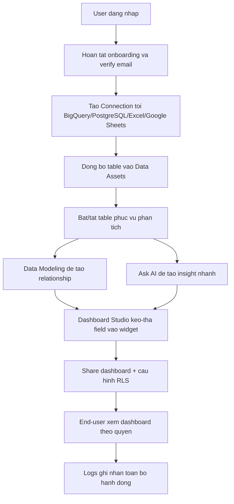

# 01. Tong Quan Va Flow Tong

## 1. Toan canh he thong cho end-user
He thong 360Data co 8 lop thao tac chinh:
1. Xac thuc tai khoan (`Auth/Onboarding`).
2. Ket noi nguon du lieu (`Connections`).
3. Quan ly bang da dong bo (`Data Assets`).
4. Phan tich bang AI hoi-dap (`Ask AI`).
5. Chuan hoa logic bang quan he du lieu (`Data Modeling`).
6. Dung dashboard truc quan (`Dashboard Studio`).
7. Quan ly chia se va bao mat dong du lieu (`Share + RLS`).
8. Giam sat lich su thao tac (`Logs`).

## 2. Flow nghiep vu tu dau den cuoi

## 3. Kich ban van hanh mau (khuyen nghi)
1. Admin dang nhap va tao ket noi du lieu.
2. Admin kiem tra Data Assets, tat cac bang khong dung.
3. Admin vao Data Modeling tao quan he giua cac bang chinh.
4. Admin/Editor vao Dashboard Studio tao dashboard dau tien.
5. Admin chia se dashboard cho Editor/Viewer, cau hinh RLS neu can.
6. Nguoi dung vao Ask AI de dat cau hoi bo sung, truy vet SQL.
7. Doi van hanh theo doi Logs de audit.

## 4. Cac diem kiem soat quan trong
- Khong co Connection thi `Data Assets`, `Ask AI`, `Data Modeling`, `Dashboard Studio` bi khoa.
- RLS can cau hinh day du truoc khi cho phep truy cap du lieu nhay cam.
- Trong Ask AI, context table phai duoc chon dung, neu khong ket qua se sai ngu canh.
- Data Modeling nen hoan tat truoc khi lam dashboard lon de tranh sai join.

## 5. Hinh minh hoa can co cho chuong tong quan

- Callout 1: Vi tri menu trai.
- Callout 2: Thu tu thao tac module.
- Callout 3: Diem gate "co connection moi mo khoa module".

- Callout 1: Luong Admin setup.
- Callout 2: Luong Viewer su dung.
- Callout 3: Diem kiem soat bao mat (Share/RLS/Logs).

