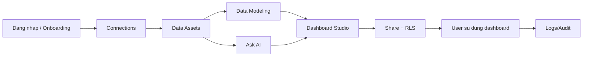

# Bo Tai Lieu Huong Dan End-User - 360Data Solutions

Tai lieu nay dung cho nguoi dung cuoi (Admin/Editor/Viewer) de van hanh he thong tu ket noi du lieu den tao dashboard va chia se.

## 1. Muc tieu bo tai lieu
- Cung cap flow tong the cua he thong.
- Mo ta thao tac chi tiet theo tung module.
- Chuan hoa huong dan chup anh minh hoa cho team trien khai tai lieu/noi bo.

## 2. Duong dan doc de xuat
1. [01. Tong Quan Va Flow Tong](./01-overview-flow.md)
2. [02. Dang Nhap Va Onboarding](./02-auth-onboarding.md)
3. [03. Connections - Ket Noi Nguon Du Lieu](./03-connections.md)
4. [04. Data Assets - Quan Ly Bang Du Lieu](./04-data-assets.md)
5. [05. Ask AI - Bao Cao Tu Van Du Lieu](./05-ask-ai-reports.md)
6. [06. Data Modeling - Semantic Layer](./06-data-modeling.md)
7. [07. Dashboard Studio - BI Builder](./07-dashboard-studio.md)
8. [08. AI Settings - Cau Hinh API Key](./08-ai-settings.md)
9. [09. User Management - Quan Ly Nguoi Dung](./09-user-management.md)
10. [10. Logs - Audit Trail](./10-logs.md)
11. [11. Troubleshooting & FAQ](./11-troubleshooting-faq.md)
12. [Global Assistant v1](./05-ask-ai-reports.md#7-global-assistant-v1)

## 2.1 Tai lieu bo sung (nang cao)
- [Huong Dan Measure & Calculated Fields](../USER_GUIDE_MEASURES.md)

## 3. Ma tran quyen truy cap nhanh
| Module | Admin | Editor | Viewer |
|---|---|---|---|
| Connections | Toan quyen | Thuong khong thao tac (theo chinh sach) | Khong |
| Data Assets | Toan quyen | Co the xem/tinh chinh theo quyen workspace | Xem |
| Ask AI | Toan quyen | Xem/hoi theo context duoc cap | Xem/hoi theo context duoc cap |
| Data Modeling | Sua duoc | Sua duoc | Chi doc |
| Dashboard Studio | Toan quyen + share | Tao/sua dashboard theo quyen duoc cap | Xem theo quyen duoc share |
| AI Settings | Thuong Admin | Thuong khong | Khong |
| User Management | Toan quyen | Khong | Khong |
| Logs | Xem (khuyen nghi Admin) | Xem (neu duoc cap) | Khong |
| Global Assistant | Thuc thi toan bo action trong scope quyen | Thuc thi action duoc cap quyen | Chat/hoi dap, action bi gioi han theo role |

## 4. Flow tong he thong (nhin nhanh)

## 5. Quy uoc tai lieu hinh anh
- Danh sach anh can chup nam tai: [images/IMAGE_SHOT_LIST.md](./images/IMAGE_SHOT_LIST.md)
- Cac markdown image trong tung module dang la **slot ten file chuan** de team bo sung screenshot that.
- Quy uoc ten file:
  - `Mxx-yy-ten-man-hinh.png`
  - `Mxx`: ma module (`M01` Onboarding, `M02` Connections, ...)
  - `yy`: so thu tu buoc trong module
- Luu anh vao thu muc `docs/end-user-guide/images/`.

## 6. Dieu kien can de thao tac tai lieu nay
- Da co tai khoan workspace hop le.
- Da co quyen phu hop theo vai tro.
- Trinh duyet cho phep popup (cho OAuth Google).

## 7. Global Assistant v1 (system-wide)
- Assistant nay la floating chat chay tren toan bo he thong, khong chi trong `/bi`.
- Co 2 kenh chat:
  - `Global Assistant`: thao tac lien module (connections/tables/reports/users/data-modeling/bi/navigation).
  - `Dashboard AI Chat` trong BI: giu UI hien tai, dung chung execution engine.
- Quy tac bat buoc:
  - `Safe action`: tu dong chay chuoi buoc.
  - `Risky action` (delete, disable user, doi quyen): bat buoc confirm truoc khi chay.
  - `Thieu tham so`: assistant hoi 1 cau ngan de lay du lieu con thieu.
  - `Flow OAuth/file`: assistant huong dan mo dung man hinh va tam dung cho user thao tac tay.
- Undo:
  - Ho tro cho mot so thao tac BI (create/update/delete widget, calculated field, table status toggle).
  - Khong ho tro undo hard-delete tai nguyen server.
