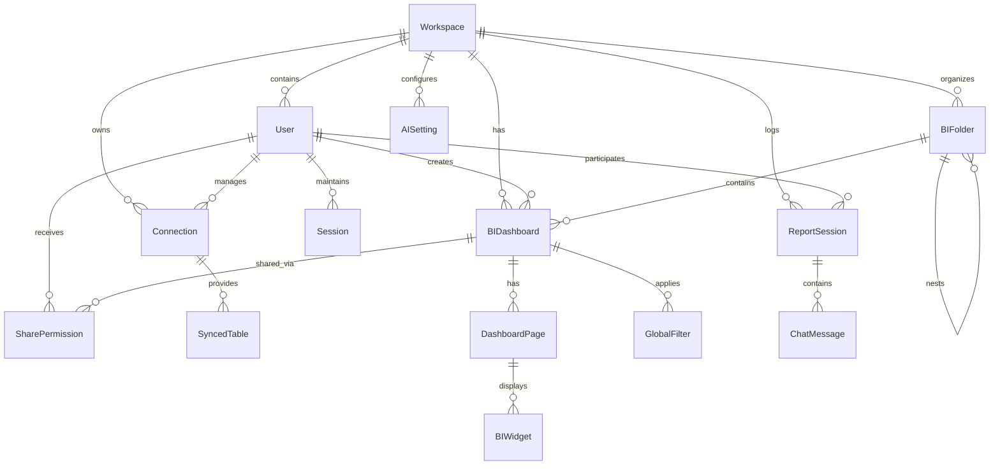

# 360data-solution Implementation Plan: Full System Audit & Persistence Fix

The current system relies heavily on `localStorage` for data persistence in the frontend, while the backend and database are only used for Authentication. This plan outlines the steps to bridge this gap, ensuring all features (Connections, Users, Ask AI, Dashboard Studio, and AI Settings) are fully persisted in the PostgreSQL database.

## 1. Database Schema Refinement
We will optimize the Prisma schema to ensure all requested features have corresponding tables and correct mappings.

### 📊 Database Diagram

## 2. Backend Enhancements
Add missing endpoints for AI Settings and Sharing permissions.

- **AI Settings Service**: Manage LLM providers (Gemini, OpenAI, etc.) per workspace.
- **Sharing Service**: Implement granular access control (view/edit) for Dashboards and Folders.
- **System Audit**: Ensure all existing routes (`connections`, `dashboards`, `folders`) correctly validate `workspaceId` from the JWT token.

## 3. Frontend Persistence Bridge
The most critical part of this task. We will refactor `App.tsx` and core components to stop using `localStorage` as the primary store.

- **Initialization**: On app load, fetch all data (`connections`, `tables`, `folders`, `dashboards`) from the backend.
- **Action Sync**: 
    - `addConnection` -> `POST /api/connections`
    - `createDashboard` -> `POST /api/dashboards`
    - `saveFolder` -> `POST /api/folders`
    - `Ask AI` -> `POST /api/sessions/:id/messages`
- **User Management**: Shift from local user list to `GET /api/users`.

## 4. Execution Steps
1. **Schema Update**: Rename `ai_settings` to `AISetting` and ensure proper relations.
2. **Backend Routes**: Create `ai-settings.ts` and `shares.ts`.
3. **Frontend API Client**: Create a unified API service to handle backend communication with Auth headers.
4. **App.tsx Refactor**: Replace `useEffect` calls that save to `localStorage` with API calls.
5. **Testing**: Create a user and a connection, then verify directly in Postgres.

---
*Generated by Huy AI - Antigravity Orchestrator*
